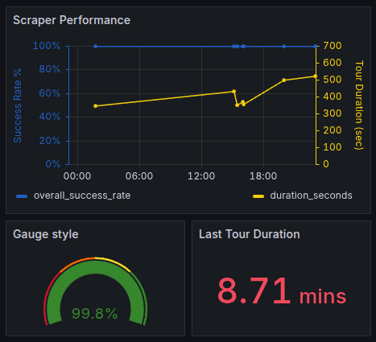

# NTV News - Automated Data Pipeline


## Summary

This project is a complete, end-to-end data pipeline designed to automatically scrape news data from NTV's RSS feeds, process it, store performance metrics in a persistent database, and visualize the scraper's health and performance in real-time. The entire stack is containerized using Docker and managed with a single command via Docker Compose.


## Key Features

-   **Automated Scraping:** Periodically fetches data from 18 different news categories via their RSS feeds.
-   **Robust Error Handling:** Implements an intelligent retry mechanism with a hybrid backoff strategy to handle transient network errors and HTTP `429 (Too Many Requests)` rate-limiting errors gracefully.
-   **Persistent Data Storage:** Tour-by-tour performance metrics (duration, success rate, data sizes, etc.) are permanently stored in a PostgreSQL database.
-   **Fully Containerized:** The entire application stack (Python Scraper, PostgreSQL DB, Grafana Dashboard) is containerized using Docker, ensuring a consistent, portable, and isolated environment that can be deployed with a single command.
-   **Real-time Monitoring:** A pre-configured Grafana dashboard connects to the PostgreSQL database to provide live visualizations of the scraper's key performance indicators (KPIs).
-   **Flexible Configuration:** All critical parameters, such as database credentials, timings, and directory names, are managed via a `.env` file for security and ease of configuration without code changes.


## System Architecture

The project follows a simple yet powerful data pipeline architecture:

```
   +------------------------+        +--------------------------+      +---------------------------+
   |                        |        |                          |      |                           |
   |  Python Scraper        |        |   PostgreSQL Database    |      |    Grafana Dashboard      |
   |  (Docker Container)    |----->  |   (Docker Container)     |<-----|    (Docker Container)     |
   |                        | Inserts|                          | Reads|                           |
   |  - Fetches RSS         | stats  |   - Stores tour stats    | data |   - Visualizes metrics    |
   |  - Downloads media     |        |   - Persists data        |      |   - Real-time monitoring  |
   |  - Calculates stats    |        |                          |      |                           |
   +------------------------+        +--------------------------+      +---------------------------+
   ```


## Tech Stack

-   **Backend:** Python 3.12
-   **Core Libraries:**
    -   `requests`: For making HTTP requests.
    -   `beautifulsoup4`: For parsing HTML content within RSS feeds.
    -   `psycopg2-binary`: For connecting to the PostgreSQL database.
    -   `python-dotenv`: For managing environment variables.
-   **Database:** PostgreSQL 16
-   **Containerization:** Docker & Docker Compose
-   **Monitoring & Visualization:** Grafana


## Configuration

All application settings are managed through a `.env` file in the root directory. Before running the project, create a `.env` file by copying the `env.example` (or creating a new one) and filling in the values.

| Variable              | Description                                                                 | Default Value                    |
| --------------------- | --------------------------------------------------------------------------- | -------------------------------- |
| `LOG_FILE_NAME`       | The name of the log file generated by the scraper.                          | `ntv_fetcher.log`                |
| `OUTPUT_DIR_NAME`     | The name of the main directory for media and JSON outputs.                  | `output_ntv`                     |
| `MEDIA_SUBDIR_NAME`   | The name of the sub-directory for downloaded media files.                   | `haber_media_ntv`                |
| `JSON_SUBDIR_NAME`    | The name of the sub-directory for generated JSON files.                     | `haber_ntv`                      |
| `SLEEP_INTERVAL`      | The wait time in seconds between each scraping tour.                        | `900`                            |
| `REQUEST_TIMEOUT`     | The timeout in seconds for HTTP requests.                                   | `5`                              |
| `TIMEZONE_OFFSET_HOURS`| The hour offset to apply for timestamps (e.g., Turkey is UTC+3).           | `3`                              |
| `USER_AGENT`          | The User-Agent string to use for HTTP requests.                             | `Mozilla/5.0 ...`                |
| `RSS_URLS`            | (Optional) A comma-separated list of RSS URLs to override the default list. | (Uses internal default list)     |
| `DB_HOST`             | **Must be `db` for Docker.** The hostname of the PostgreSQL server.         | `db`                             |
| `DB_PORT`             | The port for the PostgreSQL server.                                         | `5432`                           |
| `DB_NAME`             | The name of the database to use.                                            | `scraper_stats`                  |
| `DB_USER`             | The username for the database connection.                                   | `myuser`                         |
| `DB_PASS`             | The password for the database connection.                                   | `mypassword`                     |


## Setup and Installation

1.  **Clone the repository:**
    ```bash
    git clone [your-repository-url]
    cd [your-repository-directory]
    ```

2.  **Create and Configure `.env` file:**
    Create a `.env` file in the root directory and populate it with the configuration variables listed above.

3.  **Build and Run the Stack:**
    Use Docker Compose to build the scraper image and start all services.
    ```bash
    docker compose up --build -d
    ```


## Usage

-   **View Scraper Logs:** To see the live output of the Python scraper, run:
    ```bash
    docker compose logs -f scraper
    ```

-   **Access Grafana Dashboard:** Open your web browser and navigate to:
    [http://localhost:3000](http://localhost:3000)
    -   **Default Username:** `admin`
    -   **Default Password:** `admin`

-   **Stop the Application:** To stop all running services, run:
    ```bash
    docker compose down
    ```


## Dashboard Preview




## Future Improvements

This project provides a solid foundation for a data pipeline, but there are several avenues for future enhancement. Ideas and contributions are welcome.

-   [ ] **Implement Unit & Integration Testing:** Introduce a testing suite using `pytest` to create tests for individual functions (unit tests) and for the entire data flow (integration tests) to ensure reliability and prevent regressions.

-   [ ] **Create a CI/CD Pipeline:** Set up a GitHub Actions workflow to automatically run the test suite and build the Docker images on every push to the `main` branch, ensuring code quality and automating the build process.

-   [ ] **Cloud Deployment:** Develop a comprehensive guide or helper scripts to deploy the entire Docker Compose stack to a cloud provider (e.g., AWS EC2, DigitalOcean Droplet) for true 24/7 autonomous operation.

-   [ ] **Enhanced Alerting:** Configure Grafana's alerting features to send notifications to a platform like Slack or Discord when key metrics fall below a certain threshold (e.g., if `overall_success_rate` drops below 90%).

-   [ ] **Advanced Data Analysis:** Add a Jupyter Notebook to the repository to perform more in-depth analysis on the data collected in PostgreSQL, exploring trends and correlations over time using libraries like `pandas` and `matplotlib`.

-   [ ] **Expose Data via a REST API:** Develop a simple REST API using a modern Python framework like **FastAPI**. This API would serve the collected statistics from the PostgreSQL database. Potential endpoints could include:
    -   `GET /api/stats/latest`: To retrieve the results of the most recent scraping tour.
    -   `GET /api/stats/history`: To get a list of all historical tour stats.
    This would turn the project into a true backend service and allow other applications (e.g., a web frontend, a mobile app) to consume the scraped data programmatically.


## License

This project is licensed under the MIT License - see the [LICENSE](LICENSE) file for details.